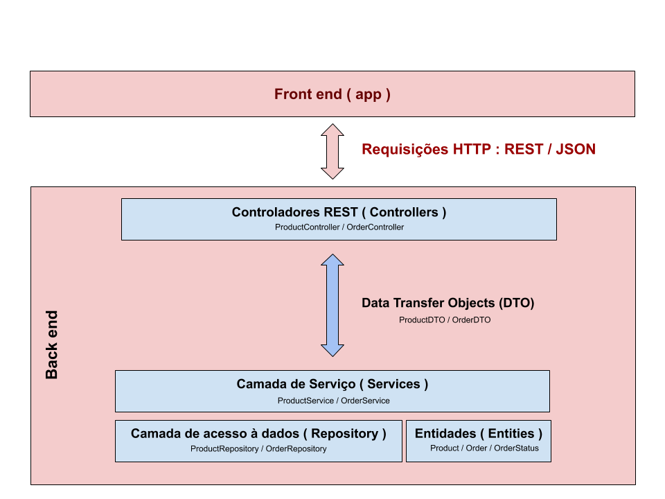
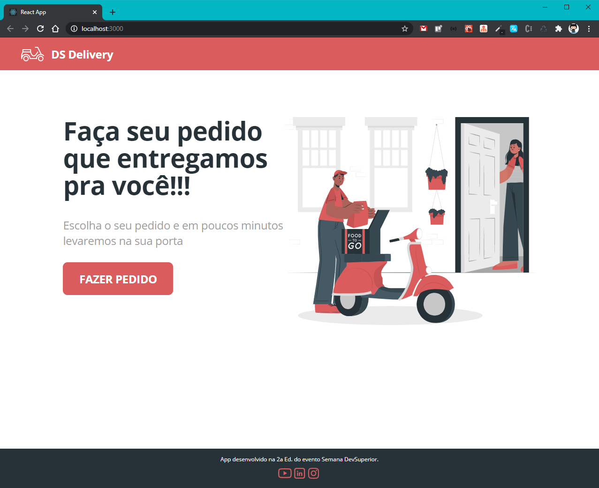
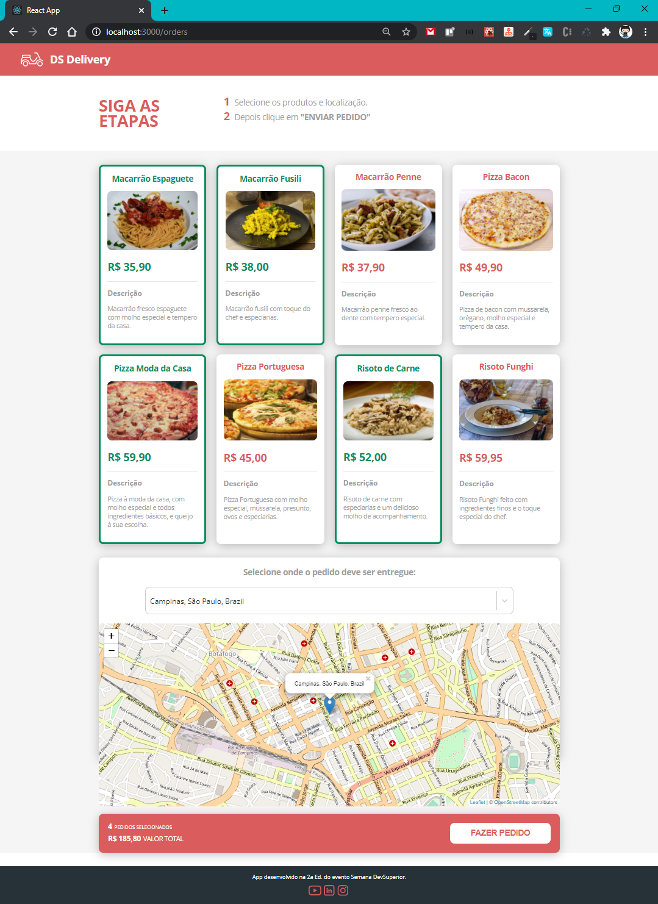
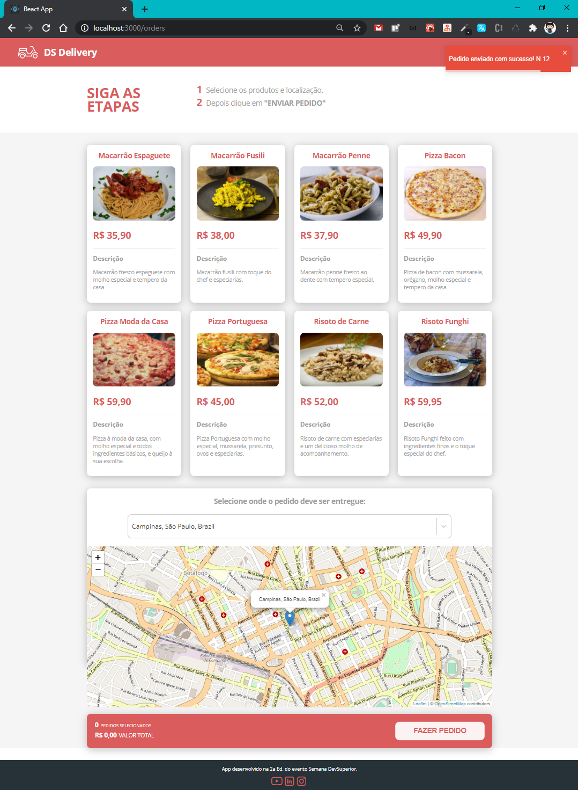
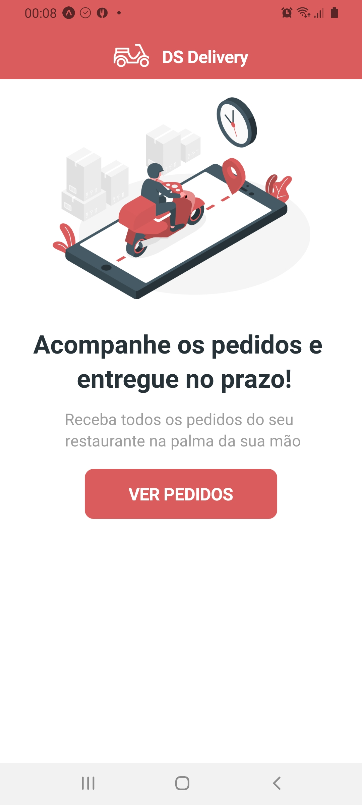
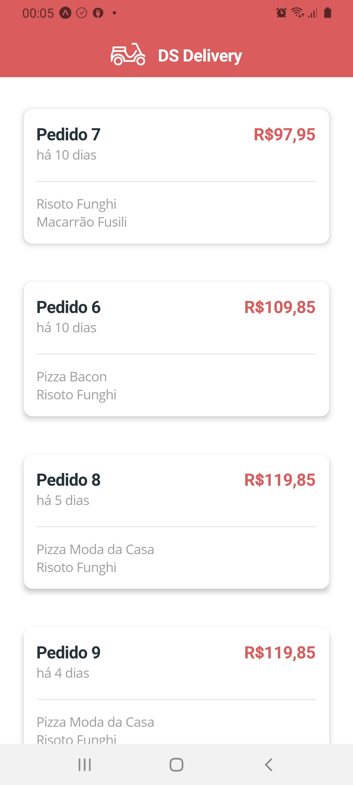
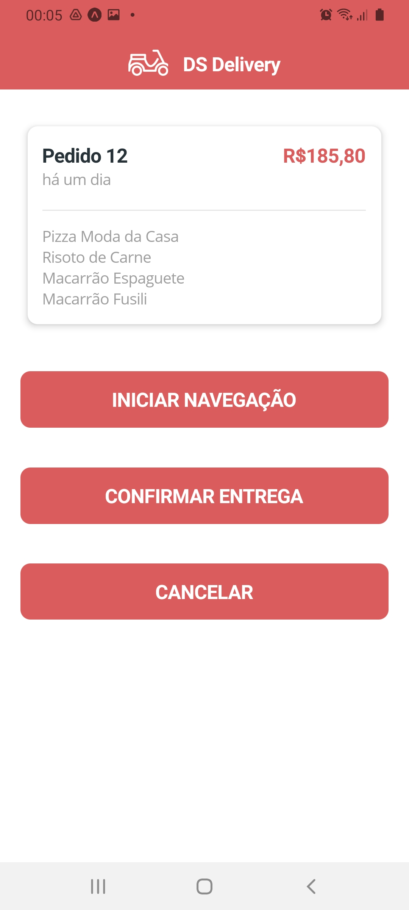

<h1 align="center" style="color:blue;font-size:50px;font-weight:bold">Semana DevSuperior 2.0</h1>
<p align="center">De 04/01 à 10/01/2021</p>
<p align="center">Projeto Finalizado</p>

<p align="center">
  <a href="#sobre">Sobre o Projeto</a>&nbsp;&nbsp;&nbsp;|&nbsp;&nbsp;&nbsp;
  <a href="#modeloconceitual">Modelo Conceitual</a>&nbsp;&nbsp;&nbsp;|&nbsp;&nbsp;&nbsp;
  <a href="#padraocamadasadotado">Padrão de camadas adotado</a>&nbsp;&nbsp;&nbsp;|&nbsp;&nbsp;&nbsp;
  <a href="#ferramentas">Ferramentas Utilizadas</a>&nbsp;&nbsp;&nbsp;|&nbsp;&nbsp;&nbsp;
  <a href="#backend">Back end</a>&nbsp;&nbsp;&nbsp;|&nbsp;&nbsp;&nbsp;
  <a href="#database">Banco de Dados</a>&nbsp;&nbsp;&nbsp;|&nbsp;&nbsp;&nbsp;
  <a href="#frontend">Front end</a>&nbsp;&nbsp;&nbsp;|&nbsp;&nbsp;&nbsp;
  <a href="#mobilemod">Mobile</a>
</p>
<!-- ************************************* Baadges ********************************************* -->
<p align="center">
  

 

  <a href="https://github.com/tgmarinho/nlw1/commits/master">
    
  </a>
</p>
<!-- ************************************* Sobre *********************************************** -->
<h2 id="sobre"> 🚀 Sobre o Projeto</h2>

O Projeto é um sistema de pedidos onde na WEB é feito o pedido, selecionando os produtos e criando o pedido em si,
no módulo mobile é onde os pedidos aparecem para que sejam entregues, dentre as funcionalidades estão selecionar o pedido e iniciar a navegação através da chamada do google Maps onde a rota de entrega será mostrada e iniciada pelo mesmo, após 
a chegada ao destino existe o botão de confirmar entrega que ao selecioná-lo e confirmar a entrega o pedido é retirado da lista de pedidos é marcado como entregue e é retornada uma mensagem que o pedido foi entregue e finalmente o cancelar que somente retorna para a tela de seleção de pedidos.

 <!-- ************************************* Modelo Conceitual ********************************** -->
<h2 id="modeloconceitual"> 🗺️ Modelo Conceitual</h2>

<h1 align="center">
    
</h1>

<!-- ********************************* Padrões de Camadas ************************************** -->
<h2 id="padraocamadasadotado"> 🛡️ Padrão de camadas adotado</h2>

<h1 align="center">
    
</h1>
<!-- ************************************* Ferramentas Utilizadas ************************** -->
<h2 id="ferramentas"> 🛠️ Ferramentas Utilizadas</h2>

- [JDK11]('https://www.oracle.com/br/java/technologies/javase-jdk11-downloads.html')
- [STS - Spring Tools Suite]('https://spring.io/tools')
- [Postman]('https://www.postman.com/downloads/')
- [Postgres 12 e pgAdmin]('https://www.postgresql.org/download/')
- [Heroku CLI]('https://devcenter.heroku.com/articles/heroku-cli')
- [NPM]('https://www.npmjs.com/')
- [VS Code]('https://code.visualstudio.com/download')
- [Git]('https://git-scm.com/downloads')

<hr>

<!-- *********************************** Imagens do Projeto ************************************ -->
<h2 id="padraocamadasadotado"> 🖼️ Imagens do Projeto </h2>
</br>
<h2 align="center">Imagens Front-end WEB</h2>
</br>
<h1 align="center">
    
    
    
</h1>
</br>
<h2 align="center">Mobile</h2>
</br>
<h1 align="center">
    
    
    
    
    
</h1>

<!-- ************************************* Back End ******************************************** -->
<h2 id="backend"> 🧰 Back end</h2>

<h4> 🔨 Tecnologias</h4>

* Java
* PostGreSQL ( Banco de Dados de Produção )
* H2 ( Banco de Dados de Testes )

<h4> ⚙️ Dependências</h4> 

* Spring Boot
  * Starter Web 
  * Starter Data JPA ( Mapemaneto Objeto Relacional )
  * Starter Validation
  * Starter Security
  * Starter Test
* H2 ( Banco de Dados em memória. Usado nos testes da aplicação )
* PostGreSQL 

<h4 style="font-weight:bold"> ⚙️ Arquivos de Configuração</h4> 

Arquivo                      | Tipo de Configuração
---------------------------  | ------
application.properties       | Configurações Gerais
application-test.properties  | Configurações para Testes
application-dev.properties   | Configurações para Desenvolvimento
application-prod.properties  | Configurações para Produção

</br>
<h4> ⚙️ Local dos Arquivos de Configuração</h4>

```bash
# Local dos arquivos 
|- /dsdeliver
  |- src/main/resources
    |- application.properties
    |- application-test.properties
    |- application-dev.properties
    |- application-prod.properties
```    

<h2>application.properties</h2>

```properties
# Seta o profile que ficará ativo
spring.profile.active=test    

# Restringe o uso do jpa até a camada de serviço não podendo ser usado para acesso aos dados
# na camada de controladores REST
spring.jpa.open-in-view=false
```

<h2>application-test.properties</h2>

```properties
# Caminho para conexão com o banco de testes
spring.datasource.url=jdbc:h2:mem:testdb 

# usuario do banco de testes
spring.datasource.username= <informar_usuario> 

# senha do banco de testes
spring.datasource.password= <informar_senha> 
```

<h2>application-dev.properties</h2>

```properties
# Rotinas comentadas são para gerar o script de criação do Banco de Dados
#spring.jpa.properties.javax.persistence.schema-generation.create-source=metadata
#spring.jpa.properties.javax.persistence.schema-generation.scripts.action=create
#spring.jpa.properties.javax.persistence.schema-generation.scripts.create-target=create.sql
#spring.jpa.properties.hibernate.hbm2ddl.delimiter=;

spring.datasource.url=jdbc:postgresql://localhost:5432/dsdeliver
spring.datasource.username=postgres
spring.datasource.password=1234567

spring.jpa.properties.hibernate.jdbc.lob.non_contextual_creation=true
spring.jpa.hibernate.ddl-auto=none

```

<h2>application-prod.properties</h2>

```properties
# Caminho da Base de Dados de Produção
spring.datasource.url=${DATABASE_URL}
```
</br>
<h2 style="font-weight:bold"> 🔚 End Points da API</h2> 

<h3 style="font-weight:bold"> API de Produtos </h3>

| Route             | Response Formats | Resource URL                                 |  Parameters |
|-------------------|------------------|----------------------------------------------|-------------|
| GET  /products    | JSON             | http://localhost:8080/products               | None        |

</br>

| Route             | Description                                                                    |
|-------------------|--------------------------------------------------------------------------------|
| GET  /products    | Retorna uma lista de todos os Produtos ordenados pelo Id em ordem ascendente   |

</br>
<h3 style="font-weight:bold">API de Pedidos</h3>

| Route             | Response Formats | Resource URL                                 |  Parameters |
|-------------------|------------------|----------------------------------------------|-------------|
| GET  /orders      | JSON             | http://localhost:8080/orders                 | None        |
| POST /orders      | JSON             | http://localhost:8080/orders                 | JSON Body   |
| PUT  /orders      | JSON             | http://localhost:8080/orders/{id}/delivered  | Id Order    |

</br>

| Route             | Description                                                                   |
|-------------------|---------------|
| GET  /orders      | Retorna todos os Pedidos de status 'PENDING' juntamente com os produtos em ordem Ascendente |
| POST /orders      | Efetua a gravação do Pedido no Banco de Dados juntamente com os Produtos selecionados |
| PUT  /orders      | Atualiza o status do Pedido para 'DELIVERED'               |

</br>
<h3 style="font-weight:bold">POST /orders ( Formato de envio do Pedido )</h3>

```json
{
    "address": "Avenida Paulista, 1500",
    "latitude": -23.56168,
    "longitude": -46.656139,
    "products": [
        {
            "id": 2
        },
        {
             "id": 5
        }
     ]
}
```

</br>
<h3> 🎲 Rodando o Back end</h3>

```bash
# Clone este repositório
$ git clone https://github.com/brunoemferreira/semana_dev_superior_02.git

# Acesse a pasta backend
$ cd backend

# execute o comando
$ yarn start
ou
$ npm start

# O servidor inciará na porta:3000
```

<hr>
<h2 id="database"> 🗄️ Banco de Dados de Testes ( H2 )</h2>

```
// Após Rodar o Backend com profile de testes este é o endereço de acesso a interface do Banco

http://localhost:8080/h2-console

```

<hr>
<h2 id="database"> 🗄️ Banco de Dados Produção ( PostgreSQL )</h2>

<h4> 🔨 Scripts para Popular as Tabelas </h4>

```sql
INSERT INTO tb_product (name, price, image_Uri, description) VALUES ('Pizza Bacon', 49.9, 'https://raw.githubusercontent.com/devsuperior/sds2/master/assets/pizza_bacon.jpg', 'Pizza de bacon com mussarela, orégano, molho especial e tempero da casa.');
INSERT INTO tb_product (name, price, image_Uri, description) VALUES ('Pizza Moda da Casa', 59.9, 'https://raw.githubusercontent.com/devsuperior/sds2/master/assets/pizza_moda.jpg', 'Pizza à moda da casa, com molho especial e todos ingredientes básicos, e queijo à sua escolha.');
INSERT INTO tb_product (name, price, image_Uri, description) VALUES ('Pizza Portuguesa', 45.0, 'https://raw.githubusercontent.com/devsuperior/sds2/master/assets/pizza_portuguesa.jpg', 'Pizza Portuguesa com molho especial, mussarela, presunto, ovos e especiarias.');
INSERT INTO tb_product (name, price, image_Uri, description) VALUES ('Risoto de Carne', 52.0, 'https://raw.githubusercontent.com/devsuperior/sds2/master/assets/risoto_carne.jpg', 'Risoto de carne com especiarias e um delicioso molho de acompanhamento.');
INSERT INTO tb_product (name, price, image_Uri, description) VALUES ('Risoto Funghi', 59.95, 'https://raw.githubusercontent.com/devsuperior/sds2/master/assets/risoto_funghi.jpg', 'Risoto Funghi feito com ingredientes finos e o toque especial do chef.');
INSERT INTO tb_product (name, price, image_Uri, description) VALUES ('Macarrão Espaguete', 35.9, 'https://raw.githubusercontent.com/devsuperior/sds2/master/assets/macarrao_espaguete.jpg', 'Macarrão fresco espaguete com molho especial e tempero da casa.');
INSERT INTO tb_product (name, price, image_Uri, description) VALUES ('Macarrão Fusili', 38.0, 'https://raw.githubusercontent.com/devsuperior/sds2/master/assets/macarrao_fusili.jpg', 'Macarrão fusili com toque do chef e especiarias.');
INSERT INTO tb_product (name, price, image_Uri, description) VALUES ('Macarrão Penne', 37.9, 'https://raw.githubusercontent.com/devsuperior/sds2/master/assets/macarrao_penne.jpg', 'Macarrão penne fresco ao dente com tempero especial.');

INSERT INTO tb_order (status, latitude, longitude, address, moment) VALUES (0, -23.561680, -46.656139, 'Avenida Paulista, 1500', TIMESTAMP WITH TIME ZONE '2021-01-01T10:00:00Z');
INSERT INTO tb_order (status, latitude, longitude, address, moment) VALUES (1, -22.946779, -43.217753, 'Avenida Paulista, 1500', TIMESTAMP WITH TIME ZONE '2021-01-01T15:00:00Z');
INSERT INTO tb_order (status, latitude, longitude, address, moment) VALUES (0, -25.439787, -49.237759, 'Avenida Paulista, 1500', TIMESTAMP WITH TIME ZONE '2021-01-01T16:00:00Z');
INSERT INTO tb_order (status, latitude, longitude, address, moment) VALUES (0, -23.561680, -46.656139, 'Avenida Paulista, 1500', TIMESTAMP WITH TIME ZONE '2021-01-01T12:00:00Z');
INSERT INTO tb_order (status, latitude, longitude, address, moment) VALUES (1, -23.561680, -46.656139, 'Avenida Paulista, 1500', TIMESTAMP WITH TIME ZONE '2021-01-01T08:00:00Z');
INSERT INTO tb_order (status, latitude, longitude, address, moment) VALUES (0, -23.561680, -46.656139, 'Avenida Paulista, 1500', TIMESTAMP WITH TIME ZONE '2021-01-01T14:00:00Z');
INSERT INTO tb_order (status, latitude, longitude, address, moment) VALUES (0, -23.561680, -46.656139, 'Avenida Paulista, 1500', TIMESTAMP WITH TIME ZONE '2021-01-01T09:00:00Z');

INSERT INTO tb_order_product (order_id, product_id) VALUES (1 , 1);
INSERT INTO tb_order_product (order_id, product_id) VALUES (1 , 4);
INSERT INTO tb_order_product (order_id, product_id) VALUES (2 , 2);
INSERT INTO tb_order_product (order_id, product_id) VALUES (2 , 5);
INSERT INTO tb_order_product (order_id, product_id) VALUES (2 , 8);
INSERT INTO tb_order_product (order_id, product_id) VALUES (3 , 3);
INSERT INTO tb_order_product (order_id, product_id) VALUES (3 , 4);
INSERT INTO tb_order_product (order_id, product_id) VALUES (4 , 2);
INSERT INTO tb_order_product (order_id, product_id) VALUES (4 , 6);
INSERT INTO tb_order_product (order_id, product_id) VALUES (5 , 4);
INSERT INTO tb_order_product (order_id, product_id) VALUES (5 , 6);
INSERT INTO tb_order_product (order_id, product_id) VALUES (6 , 5);
INSERT INTO tb_order_product (order_id, product_id) VALUES (6 , 1);
INSERT INTO tb_order_product (order_id, product_id) VALUES (7 , 7);
INSERT INTO tb_order_product (order_id, product_id) VALUES (7 , 5);
```

<hr>
<!-- ************************************** Front End ****************************************** -->
<h2 id="frontend"> 🔩 Front end</h2>

<h4> 🔨 Tecnologias</h4>

- ReactJS
- JavaScript
- TypeScript
- Expo

<h4> ⚙️ Dependências</h4> 

- React
- React Dom
- Axios
- Leaflet
- React Leaflet
- React Router Dom
- React Scripts
- React Select
- React Toastify
- Typescript
- Web Vitals

<h3> 🎲 Rodando o Front end</h3>

```bash
# Clone este repositório
$ git clone https://github.com/brunoemferreira/semana_dev_superior_02.git

# Acesse a pasta backend
$ cd front-web

# Execute o comando para instalar as dependências
$ yarn install
ou
$ npm install

# execute o comando
$ yarn start
ou
$ npm start

```
<hr>
<!-- ***************************************** Mobile ****************************************** -->
<h2 id="mobilemod"> 📱 Mobile</h2>

<h4> 🔨 Tecnologias</h4>

- React Native
- Expo

<h4> ⚙️ Dependências</h4> 

 - Axios
 - DayJS
 - Expo
 - Expo App Loading
 - Expo Font
 - Expo Status Bar
 - Intl
 - E Bibliotecas React Native... 

<h3> 🎲 Rodando o Mobile</h3>

- É Necessário : 
    - Ter o Expo Instalado no PC
    - Ter o Expo Instalado no Celular

```bash
# Clone este repositório
$ git clone https://github.com/brunoemferreira/semana_dev_superior_02.git

# Acesse a pasta backend
$ cd front-mobile

# execute o comando
$ yarn start
ou
$ npm start

# O Expo é iniciado no pc mediante o browser e após esse processo acessar o celular e executar o expo
# e fazer a leitura do QRCode que é mostrado no bowser pelo Expo.
```

<hr>


